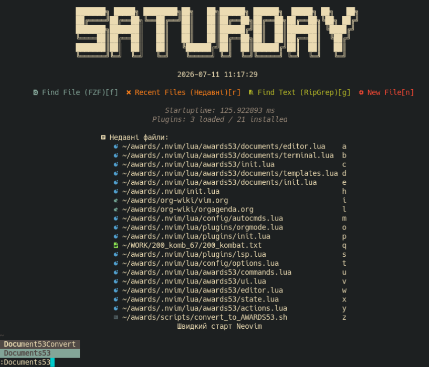
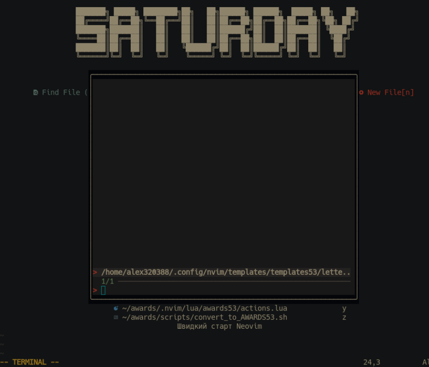
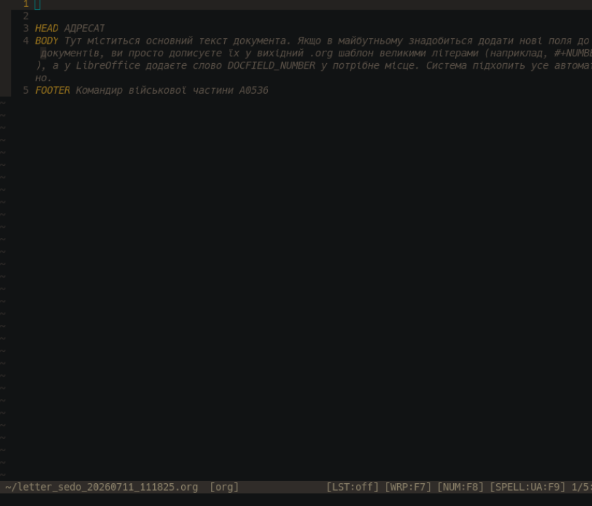
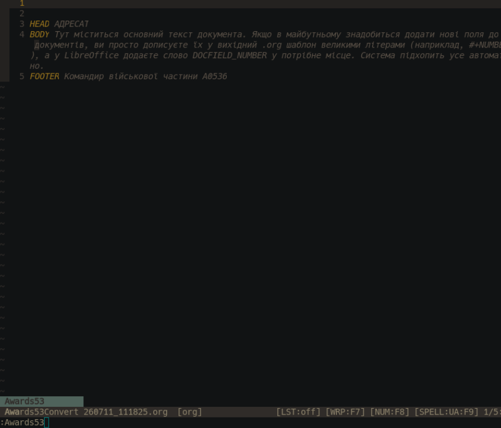
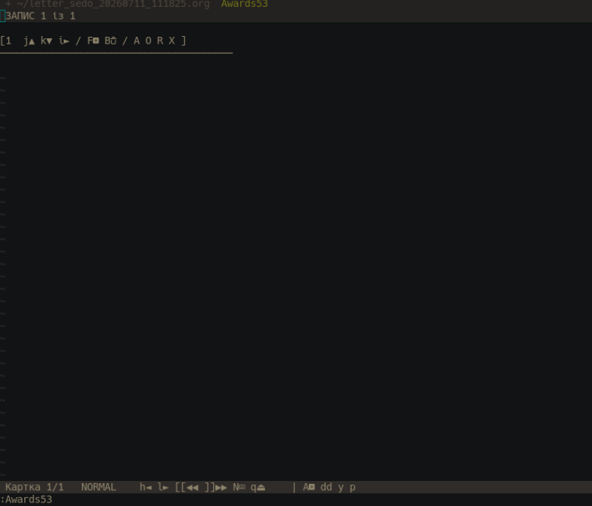
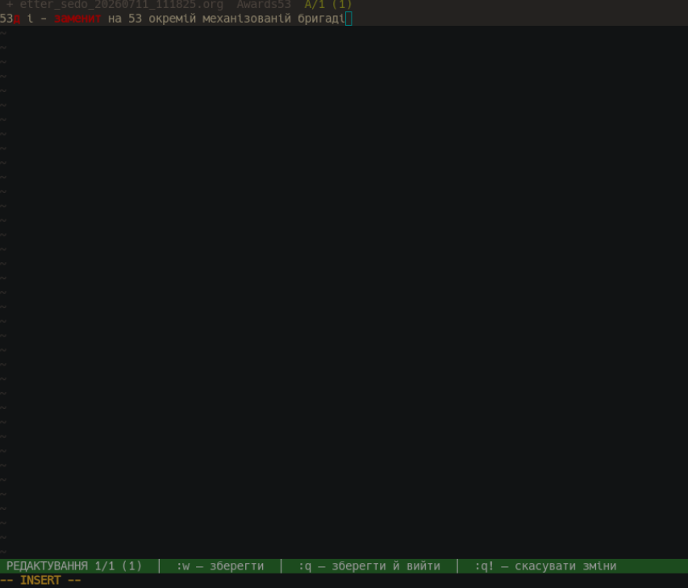

# awards53.nvim

Плагін для керування та редагування нагородних листів у форматі Org-mode в Neovim.
Також вміє створювати повноцінні документи з шаблонів libreoffice шляхом додавання тексту в визначені поля.

## 🚀 Встановлення

З використанням **lazy.nvim**:

```lua
{
    "suozg/awards53.nvim",
    config = function()
        require("awards53").setup()
    end
}
```

## Команди

:Awards53 - створення файлу org та відкриття картки наповнення

:Documents53Convert - конвертація в odt

:Awards53abbr - редагування списку аббревіатур

:Documents53  - показ вікна вибору шаблону 

bash/convert_to_AWARDS53.sh - скрипт робить з вордівського файл org, який можна оброблювати надалі в :Awards53


Наприклад - присилають підрозділи чернетки подань.

Зазвичай це табличка
| № | ПІБ | звання, посада | текст подання  |

Скрипт конвертує це діло в спеціальну структуру текстового документу org, який оброблюєтся звичайними командами. cat file1 >> file2 - зливаємо файли в один, прибираємо зайві мітки і отримуємо готовий файл без поламаного форматування. 

Плюси - швидкість, пошук через rg і пакетна обробка командами роботи з текстом linux.
Після конвертації документи всі однакові, тому що _шаблон_.

---
Робота :Documents53






Запуск :Awards53



