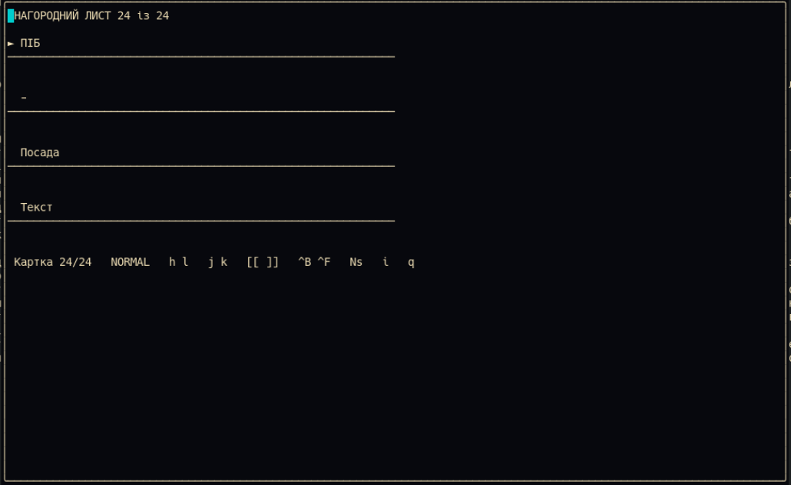

# awards53.nvim

Плагін для керування та редагування нагородних листів у форматі Org-mode в Neovim.

## 🚀 Встановлення

З використанням **lazy.nvim**:

```lua
{
    "suozg/awards53.nvim",
    config = function()
        require("awards53").setup()
    end
}


