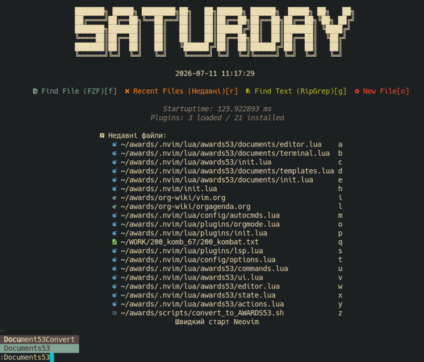
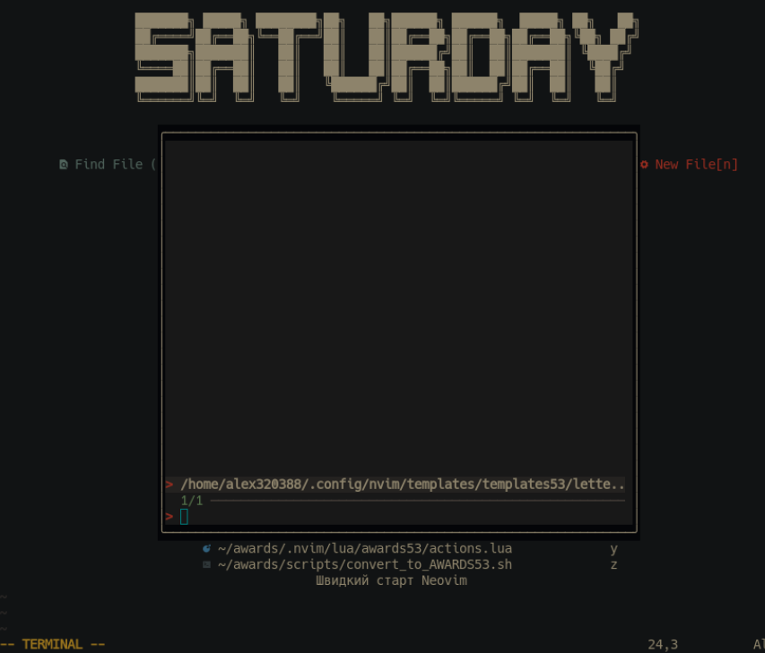
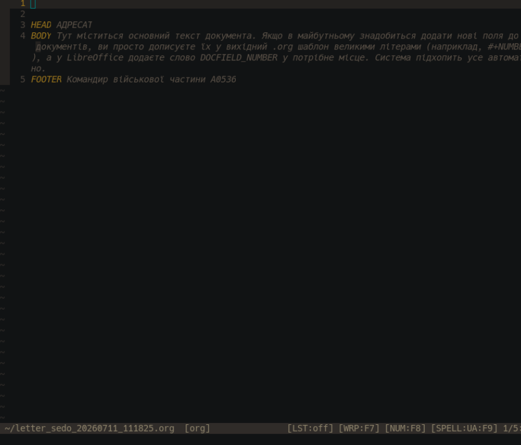
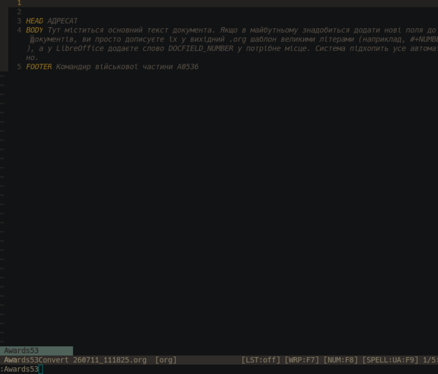
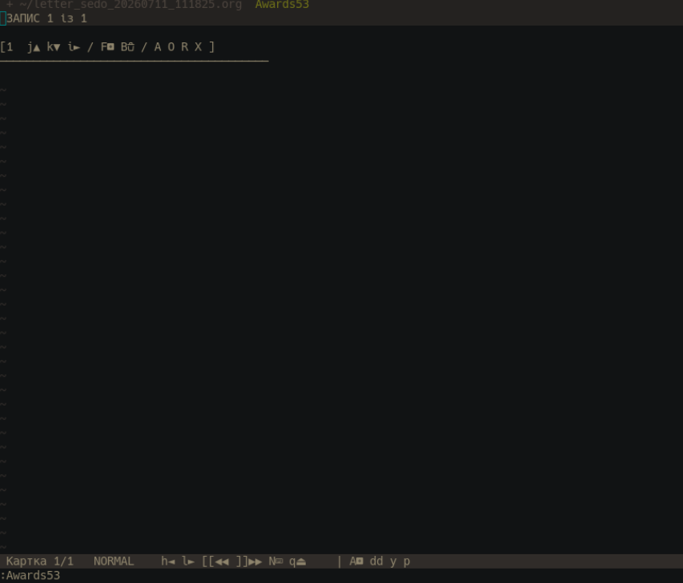
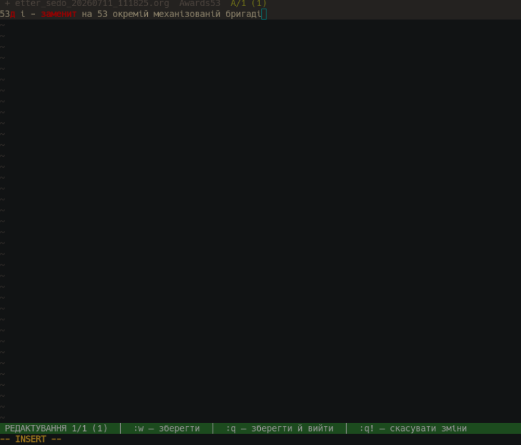

# awards53.nvim

Плагін для [Neovim](https://neovim.io/) для підготовки та редагування нагородних листів у форматі Org-mode.

Плагін призначений для роботи з базами карток `Awards53`, у яких кожна картка складається з кількох текстових полів.

## Можливості

- інтерактивне редагування карток Awards53 у спеціальному вікні;
- навігація між картками та полями;
- створення, видалення й переміщення карток;
- створення, видалення та перестановка полів;
- пошук по вибраному полю або полю за замовчуванням;
- пошук даних у каталозі STATISTIKA та зашифрованій базі SQLCipher;
- сортування українського тексту;
- закладки карток;
- копіювання, вирізання та вставка карток;
- Undo/Redo, пошук по історії змін і перегляд diff;
- перевірка РНОКПП у тексті;
- очищення невидимих символів після імпорту з офісних документів;
- захист від одночасного редагування одного Awards53-документа;
- створення документів із шаблонів `.org` та `.odt`;
- захист технічних полів Documents53;
- конвертація Word/ODT-таблиць у структуру Awards53.

## Встановлення

### lazy.nvim

```lua
{
    "suozg/awards53.nvim",
    config = function()
        require("awards53").setup()
    end,
}
```

За потреби параметри можна передати в `setup()`:

```lua
require("awards53").setup({
    separator = "::",
    record_separator = "===",
    section = "AWARDS53",
    default_sort = "1",
})
```

### Структура конфігурації

Для функцій Documents53 плагін за замовчуванням очікує шаблони в каталозі:

```text
~/.config/nvim/templates/templates53
```

Цей шлях можна змінити у модулі конфігурації документів:

```text
nvim/lua/awards53/documents/config.lua
```

## Залежності

Для базової роботи плагіна достатньо Neovim і `lazy.nvim` або іншого менеджера плагінів.

Для додаткових можливостей потрібні зовнішні програми:

- `pandoc` — конвертація Word/ODT-файлів;
- `libreoffice` або `soffice` — конвертація офісних документів;
- `fzf` — вибір шаблонів Documents53;
- `xkb-switch` — необов'язкова підтримка перемикання розкладки;
- `dwmblocks` — необов'язково, для оновлення статусної панелі;
- `gpg` — пошук у зашифрованих файлах STATISTIKA;
- `rg` або `grep` — текстовий пошук;
- `sqlcipher` — пошук у зашифрованій базі нагород;
- `pdftotext` — пошук у PDF-файлах.

Перевірити наявність програм можна так:

```bash
command -v nvim
command -v pandoc
command -v libreoffice
command -v fzf
command -v gpg
command -v rg
command -v sqlcipher
command -v pdftotext
```

## Команди

### Awards53

```vim
:Awards53
```

Відкриває редактор карток. Файл із базою має містити заголовок:

```org
* AWARDS53
```

### Documents53

```vim
:Documents53
```

Відкриває меню роботи з шаблонами Documents53.

### Конвертація документа

```vim
:Documents53Convert
```

Конвертує поточний Awards53 або Documents53-документ у відповідний вихідний формат.

### Аббревіатури

```vim
:Awards53abbr
```

Відкриває редактор списку аббревіатур.

### Команди у вікні редактора карток

```vim
:W
:Q
:Q!
```

- `:W` — синхронізувати картки з вихідним буфером і зберегти файл;
- `:Q` — закрити редактор;
- `:Q!` — примусово закрити редактор.

## Формат Awards53

```org
* AWARDS53

Іван Петренко
::
старший сержант, командир відділення
::
За сумлінне виконання службових обов'язків.
===

Петро Коваленко
::
солдат
::
За високий професіоналізм.
```

Правила формату:

- `* AWARDS53` — початок бази;
- `::` — роздільник полів усередині картки;
- `===` — роздільник карток;
- наступний Org-heading (`*`, `**` тощо), крім `* AWARDS53`, завершує блок Awards53;
- поля можуть містити декілька рядків;
- кількість полів визначається за найбільшою кількістю полів серед карток.

Роздільники можна змінити через `setup()`.

## Клавіші редактора карток

### Навігація

| Клавіша | Дія |
| --- | --- |
| `h` / `l` | попередня / наступна картка |
| `[[` / `]]` | перша / остання картка |
| `H` / `L` | перейти на 5 карток назад / уперед |
| `g` | перейти до картки за номером |
| `j` / `k` | наступне / попереднє поле |
| `f` | перейти до поля за номером |
| `m` | встановити або зняти закладку |
| `]m` / `[m` | наступна / попередня закладка |

### Редагування

| Клавіша | Дія |
| --- | --- |
| `A` | додати нову картку |
| `F` / `F-` | додати поле / поле зі значенням `-` |
| `B` | видалити поточне поле |
| `dd` | скопіювати та видалити картку |
| `yy` | скопіювати картку |
| `p` | вставити картку після поточної |
| `J` / `K` | перемістити вміст поля вниз / вгору |
| `u` | скасувати дію |
| `<C-r>` | повторити дію |
| `U` | відкрити історію змін та preview diff |
| `dp` | перемістити картку у `fork.org` |
| `i` | редагувати поточне поле inline у картці |
| `I` | відкрити поточне поле в окремому редакторі |
| `<Esc>` | зберегти inline-редагування |
| `<C-c>` | скасувати inline-редагування |

### Пошук і сортування

| Клавіша | Дія |
| --- | --- |
| `/` | пошук у полі за замовчуванням |
| `g/` | вибрати поле та виконати пошук |
| `n` / `N` | наступний / попередній результат |
| `S` | сортувати за полем за замовчуванням |
| `O` | поставити офіцерів першими |
| `0` | стиснути порожні поля по всій базі |
| `?` | відкрити довідку |

Для переходу або вибору поля можна використовувати числовий префікс: `5g` — картка №5, `3f` — поле №3.

## Пошук у STATISTIKA та базі SQLCipher

Пошук доступний у вікні редагування поля (`i`):

| Клавіша | Дія |
| --- | --- |
| `f` | пошук у каталозі STATISTIKA |
| `a` | пошук у базі нагород SQLCipher |
| `c` | очистити кеш паролів пошуку |

### Каталог STATISTIKA

Пошук виконується скриптом `nvim/bin/search.sh`. Фактичний шлях, заданий у коді, — `~/STATYSTYKA/shtat/` (із літерою `Y`):

```lua
-- nvim/lua/awards53/searchtxt.lua
local SEARCH_DIR = vim.fn.expand("~/STATYSTYKA/shtat/")
```

Скрипт підтримує `txt`, `csv`, `log`, офісні файли `doc*`, `xls*`, `odt`, `ods`, PDF та зашифровані `*.gpg`. Для GPG-файлів використовується тимчасова розшифровка, для PDF — `pdftotext`, для офісних документів — `soffice --headless`. Тимчасові файли видаляються після пошуку.

Якщо поточна картка містить десятизначний РНОКПП, він автоматично використовується як початковий запит. Для зашифрованих файлів плагін запитує GPG-пароль. Результати показуються у плаваючому вікні: `<Space>` позначає результати, `<CR>` вставляє вибрані рядки, `q` закриває вікно.

#### Як змінити шлях до STATISTIKA

Путь змінюється безпосередньо у файлі:

```text
nvim/lua/awards53/searchtxt.lua
```

Знайдіть змінну `SEARCH_DIR` і замініть шлях усередині `vim.fn.expand()`:

```lua
local SEARCH_DIR = vim.fn.expand("~/Documents/statistika/")
```

Для абсолютного шляху можна вказати його без `vim.fn.expand()`:

```lua
local SEARCH_DIR = "/mnt/data/STATISTIKA/shtat/"
```

Після зміни перезапустіть Neovim або перезавантажте конфігурацію. Каталог має існувати:

```bash
ls -la ~/STATYSTYKA/shtat/
```

Якщо каталогу немає, скрипт повідомить: `Помилка: Папка не існує: ...`.

### База SQLCipher

Пошук виконується `nvim/bin/sql_search.sh`. Типовий файл бази:

```text
~/awards/awards_v4e.db
```

Шлях задається у `nvim/lua/awards53/searchtxt.lua` у змінній `DB_PATH`. Скрипт використовує `sqlcipher`, `cipher_compatibility = 3`, `kdf_iter = 64000` і шукає за початком `personality.name` або `personality.inn`, об'єднуючи таблиці `meed`, `personality` та `award`.

Пароль SQLCipher вводиться приховано і кешується лише протягом поточної сесії Neovim. Клавіша `c` очищає кеш паролів. Результати можна вибрати та вставити у поточне поле.

Плагін очікує скрипти за шляхами `~/.config/nvim/bin/search.sh` і `~/.config/nvim/bin/sql_search.sh`. За потреби:

```bash
mkdir -p ~/.config/nvim/bin
cp nvim/bin/search.sh nvim/bin/sql_search.sh ~/.config/nvim/bin/
chmod +x ~/.config/nvim/bin/search.sh ~/.config/nvim/bin/sql_search.sh
```

## Історія змін і preview diff

Натисніть `U`, щоб відкрити два плаваючі вікна:

- ліворуч — список станів undo з номером послідовності та часом;
- праворуч — preview різниці для вибраного стану.

Під час переміщення курсора список diff оновлюється автоматично. Порівняння виконується через `vim.diff` з алгоритмом Myers, а додані, вилучені та службові рядки підсвічуються як diff. Історичний стан тимчасово читається для побудови preview, після чого поточний стан документа відновлюється.

- `<CR>` — відновити документ до вибраного стану;
- `q` або `<Esc>` — закрити історію без відновлення;
- `u` — скасувати останню дію;
- `<C-r>` — повторити дію.

Розраховані diff кешуються до закриття вікна історії. Якщо історія порожня, плагін показує повідомлення.

## Захист від повторного відкриття

Плагін не дозволяє одночасно редагувати один Awards53-документ у кількох редакторах. Використовуються внутрішня перевірка та lock-файл поруч із документом:

```text
file.org.awards53.lock
```

Не видаляйте активний lock, якщо документ відкритий в іншому Neovim.

## Documents53 і шаблони

Шаблон може містити:

```org
#+ODT_STYLES_FILE: /path/to/style.odt
#+DOC53_REQUIRED: #+DOC53_NAME,#+DOC53_POSITION
```

Каталог шаблонів за замовчуванням: `~/.config/nvim/templates/templates53`.

## Імпорт таблиць із Word та ODT

```bash
bash/convert_to_AWARDS53.sh файл.docx
bash/convert_to_AWARDS53.sh файл.odt
bash/convert_to_AWARDS53.sh файл.doc
bash/convert_to_AWARDS53.sh *.docx
```

Для таблиці використовуються `::` між комірками, `===` між рядками та `* AWARDS53` як заголовок. Опціонально можна об'єднаии кілька файлів в `combined_awards.txt`.

```bash
chmod +x bash/convert_to_AWARDS53.sh bash/doc53-picker
```

## Обмеження

- одночасно редагується один Awards53-документ;
- для імпорту, конвертації та пошуку потрібні зовнішні програми;
- для пошуку в STATISTIKA потрібен доступ до каталогу, заданого в `SEARCH_DIR`;
- для SQLCipher потрібні файл бази, `sqlcipher` і пароль;
- роздільники `::` і `===` не слід використовувати як окремі рядки всередині значень полів;
- перед масовими операціями рекомендується мати резервну копію файлу.

## Скріншоти

### Documents53






### Awards53




## Розробка та перевірки

```bash
luacheck nvim/lua
stylua --check nvim/lua
shellcheck bash/convert_to_AWARDS53.sh bash/doc53-picker nvim/bin/search.sh nvim/bin/sql_search.sh
```

## Ліцензія

Дивіться файл [LICENSE](LICENSE).
